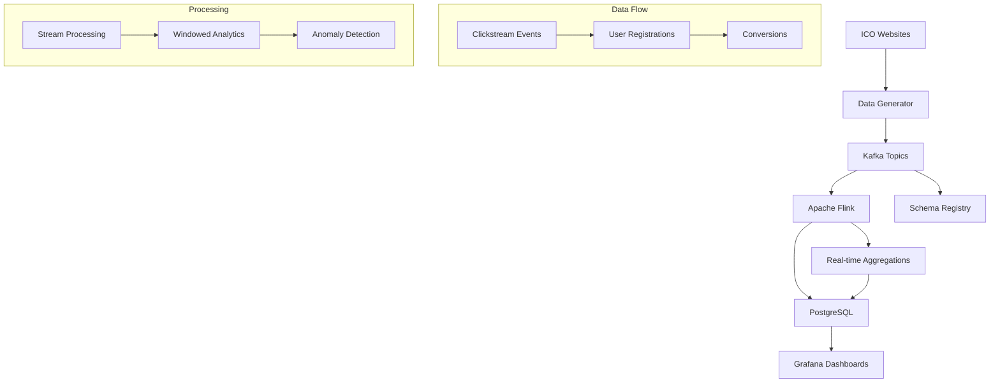

# ICO CRM Analytics Pipeline

A complete real-time data analytics pipeline for ICO (Initial Coin Offering) websites that demonstrates modern data engineering practices. This project processes clickstream events, user registrations, and conversion data in real-time to provide actionable insights for ICO projects.

## 🏗️ Architecture Overview



## 🚀 Quick Start

### Prerequisites
- Docker and Docker Compose
- At least 8GB RAM available for containers
- Ports 3000, 5432, 8080, 8081, 8082, 9092 available

### One-Command Setup
```bash
# Clone and start the pipeline
git clone <repository-url>
cd ico-analytics-pipeline
cp .env.example .env
docker-compose up -d

# Wait for services to start (about 2 minutes)
docker-compose logs -f data-generator
```

### Access the Dashboards
- **Grafana**: http://localhost:3000 (admin/admin)
- **Kafka UI**: http://localhost:8080
- **Flink Web UI**: http://localhost:8082

## 📊 Components

### Data Generator
Generates realistic ICO website events:
- **500-1000 events/minute** (configurable)
- **20 different ICO projects** with realistic data
- **Multiple event types**: clickstream, registrations, conversions
- **Geographic distribution** based on crypto-friendly countries
- **Business hours patterns** for realistic traffic
- **Data quality issues** simulation (missing fields, duplicates)

### Apache Flink Stream Processing
Real-time data processing with:
- **Exactly-once semantics** with checkpointing
- **Windowed aggregations** (5min, 15min, 1hour)
- **Data enrichment** and transformation
- **Anomaly detection** for unusual traffic patterns
- **Multiple output formats** (PostgreSQL, Kafka)

### PostgreSQL Data Warehouse
Optimized for analytics workloads:
- **Partitioned tables** by date for clickstream events
- **Materialized views** for common queries
- **Proper indexing** strategy for fast queries
- **Connection pooling** for high concurrency
- **Automated data retention** policies

### Grafana Dashboards
Production-ready visualizations:
- **Real-time metrics**: Active users, events per second
- **Business KPIs**: Conversion rates, revenue tracking
- **Geographic analytics**: Traffic by country/region
- **Performance monitoring**: Page load times, error rates
- **System health**: Kafka lag, Flink job status

## 📈 Sample Data Characteristics

### ICO Projects
- 20 different projects across various categories:
  - DeFi, Gaming, AI, Healthcare, Real Estate
  - Different target raise amounts ($15M - $120M)
  - Realistic token symbols and domains

### User Behavior Patterns
- **Session Duration**: 30s to 30+ minutes
- **Page Depth**: 1-15 pages per session
- **Device Distribution**: 60% desktop, 30% mobile, 10% tablet
- **Geographic Focus**: US, Germany, Japan, South Korea, Singapore
- **Conversion Funnel**: Visit → Signup → Wallet Connect → Purchase

### Event Types
1. **Clickstream Events** (85% of traffic)
   - Page views, button clicks, form interactions
   - Scroll depth tracking, bounce detection
   - Performance metrics (load times)

2. **User Registrations** (10% of traffic)
   - Email signups with consent tracking
   - Social media handles, wallet addresses
   - KYC verification status

3. **Conversion Events** (5% of traffic)
   - Wallet connections, presale participation
   - Token purchases ($100-$10,000 range)
   - Various payment methods (ETH, BTC, USDT, etc.)

## 🔧 Configuration

### Environment Variables
```bash
# Kafka Configuration
KAFKA_BOOTSTRAP_SERVERS=kafka:29092
SCHEMA_REGISTRY_URL=http://schema-registry:8081

# Data Generator Settings
EVENTS_PER_MINUTE=500
ICO_WEBSITES_COUNT=20
DATA_QUALITY_ISSUES=true

# PostgreSQL Settings
POSTGRES_DB=ico_analytics
POSTGRES_USER=ico_user
POSTGRES_PASSWORD=ico_password

# Flink Settings
FLINK_PARALLELISM=2
CHECKPOINT_INTERVAL=60000
```

### Scaling Configuration
```bash
# High throughput setup
EVENTS_PER_MINUTE=2000
FLINK_PARALLELISM=4
POSTGRES_MAX_CONNECTIONS=100

# Development setup  
EVENTS_PER_MINUTE=100
FLINK_PARALLELISM=1
```

## 📝 Data Schema

### Clickstream Events
```json
{
  "event_id": "uuid",
  "session_id": "uuid", 
  "user_id": "string|null",
  "timestamp": "ISO 8601",
  "event_type": "page_view|click|scroll|form_interaction",
  "page_type": "homepage|whitepaper|presale|register|...",
  "page_url": "https://...",
  "country": "United States",
  "device_type": "desktop|mobile|tablet",
  "page_load_time": 2.34,
  "ico_website_id": 1
}
```

### User Registrations
```json
{
  "registration_id": "uuid",
  "user_id": "string",
  "email": "user@example.com",
  "wallet_address": "0x...",
  "social_handles": {"twitter": "@username"},
  "consent_marketing": true,
  "kyc_completed": false,
  "verification_tier": "basic|advanced|premium",
  "ico_website_id": 1
}
```

### Conversion Events
```json
{
  "conversion_id": "uuid",
  "user_id": "string",
  "conversion_type": "presale_participate|wallet_connect|...",
  "amount_usd": 1000.00,
  "token_amount": 5000.00,
  "payment_method": "ETH|BTC|USDT|USDC",
  "time_to_convert": 3600,
  "ico_website_id": 1
}
```

## 🔍 Sample Queries

### Top Performing ICO Projects
```sql
SELECT 
  iw.name as project_name,
  COUNT(DISTINCT ce.session_id) as sessions,
  COUNT(DISTINCT r.user_id) as registrations,
  COALESCE(SUM(c.amount_usd), 0) as revenue
FROM processed_data.ico_websites iw
LEFT JOIN raw_data.clickstream_events ce ON iw.id = ce.ico_website_id
LEFT JOIN raw_data.user_registrations r ON iw.id = r.ico_website_id  
LEFT JOIN raw_data.conversions c ON r.user_id = c.user_id
WHERE ce.timestamp >= NOW() - INTERVAL '7 days'
GROUP BY iw.id, iw.name
ORDER BY revenue DESC;
```

### Real-time Active Users
```sql
SELECT COUNT(DISTINCT session_id) as active_users
FROM raw_data.clickstream_events
WHERE timestamp >= NOW() - INTERVAL '30 minutes';
```

### Conversion Funnel Analysis
```sql
WITH funnel AS (
  SELECT 
    ico_website_id,
    COUNT(DISTINCT session_id) as visitors,
    COUNT(DISTINCT CASE WHEN page_type = 'register' THEN session_id END) as register_views,
    COUNT(DISTINCT r.user_id) as registrations,
    COUNT(DISTINCT c.user_id) as conversions
  FROM raw_data.clickstream_events ce
  LEFT JOIN raw_data.user_registrations r ON ce.ico_website_id = r.ico_website_id
  LEFT JOIN raw_data.conversions c ON r.user_id = c.user_id
  WHERE ce.timestamp >= NOW() - INTERVAL '7 days'
  GROUP BY ico_website_id
)
SELECT 
  *,
  ROUND(registrations::float / visitors * 100, 2) as registration_rate,
  ROUND(conversions::float / registrations * 100, 2) as conversion_rate
FROM funnel
ORDER BY visitors DESC;
```

## 🚨 Monitoring & Alerts

### System Health Metrics
- **Kafka Lag**: Consumer lag per topic/partition
- **Flink Job Health**: Checkpointing success rate, throughput
- **PostgreSQL Performance**: Query execution time, connection pool usage
- **Data Quality**: Schema validation errors, null value rates

### Business Metrics
- **Traffic Anomalies**: Sudden traffic spikes or drops
- **Conversion Rate Changes**: Significant deviations from baseline
- **Revenue Tracking**: Daily/hourly revenue trends
- **Geographic Shifts**: Changes in traffic distribution

### Alert Thresholds
```yaml
# Kafka Consumer Lag
- alert: High Kafka Consumer Lag
  expr: kafka_consumer_lag > 10000
  for: 5m
  
# Flink Job Failure
- alert: Flink Job Down
  expr: flink_job_status != 1
  for: 1m
  
# Revenue Drop
- alert: Revenue Drop
  expr: revenue_24h < revenue_24h_baseline * 0.8
  for: 15m
```

## 🐞 Troubleshooting

### Common Issues

#### Services Won't Start
```bash
# Check available resources
docker system df
docker system prune

# Restart with fresh containers
docker-compose down -v
docker-compose up -d
```

#### No Data in Grafana
```bash
# Check data generator logs
docker-compose logs data-generator

# Verify Kafka topics
docker-compose exec kafka kafka-topics --bootstrap-server localhost:9092 --list

# Check Flink job status
curl http://localhost:8082/jobs
```

#### High Resource Usage
```bash
# Monitor resource usage
docker stats

# Scale down for development
export EVENTS_PER_MINUTE=100
docker-compose up -d data-generator
```

#### Data Quality Issues
```bash
# Check schema registry
curl http://localhost:8081/subjects

# Validate Avro messages
docker-compose exec schema-registry kafka-avro-console-consumer \
  --bootstrap-server kafka:29092 \
  --topic clickstream-events \
  --from-beginning --max-messages 10
```

### Performance Tuning

#### High Throughput Setup
```bash
# Increase Kafka partitions
docker-compose exec kafka kafka-topics --bootstrap-server localhost:9092 \
  --alter --topic clickstream-events --partitions 12

# Scale Flink task managers
docker-compose up -d --scale flink-taskmanager=4

# Tune PostgreSQL
# Edit postgres/postgresql.conf:
# shared_buffers = 512MB
# checkpoint_completion_target = 0.9
```

#### Memory Optimization
```bash
# Reduce JVM heap sizes
export FLINK_JM_HEAP=512m
export FLINK_TM_HEAP=1024m

# Limit container memory
docker-compose.yml:
  flink-jobmanager:
    mem_limit: 1g
  flink-taskmanager:
    mem_limit: 2g
```

## 📚 Advanced Features

### Stream Processing Options

#### Exactly-Once Semantics
```java
// Enable exactly-once processing
env.enableCheckpointing(60000);
env.getCheckpointConfig().setCheckpointingMode(CheckpointingMode.EXACTLY_ONCE);
env.getCheckpointConfig().setTolerableCheckpointFailureNumber(3);
```

#### Custom Windowing
```java
// Custom session windows with gap timeout
clickstreamStream
  .keyBy(event -> event.getSessionId())
  .window(ProcessingTimeSessionWindows.withGap(Time.minutes(30)))
  .aggregate(new SessionAggregator());
```

#### Anomaly Detection
```python
# Statistical anomaly detection
def detect_anomalies(events_per_minute):
    mean = historical_mean
    std = historical_std
    threshold = mean + (3 * std)  # 3-sigma rule
    return events_per_minute > threshold
```

### Data Lineage Tracking
```sql
-- Track data transformations
CREATE TABLE analytics.data_lineage (
  id SERIAL PRIMARY KEY,
  source_table TEXT,
  target_table TEXT,
  transformation TEXT,
  timestamp TIMESTAMPTZ DEFAULT NOW()
);
```

### A/B Testing Framework
```python
# A/B test variant assignment
def assign_variant(user_id, experiment_id):
    hash_input = f"{user_id}:{experiment_id}"
    hash_value = hashlib.md5(hash_input.encode()).hexdigest()
    return 'A' if int(hash_value[:8], 16) % 2 == 0 else 'B'
```

## 🏗️ Deployment Options

### Local Development
```bash
# Start core services only
docker-compose up -d zookeeper kafka schema-registry postgres

# Run data generator locally
cd data-generator
python app.py
```

### Production Deployment

#### Docker Swarm
```bash
# Initialize swarm
docker swarm init

# Deploy stack
docker stack deploy -c docker-compose.prod.yml ico-analytics
```

#### Kubernetes
```bash
# Apply manifests
kubectl apply -f k8s/namespace.yaml
kubectl apply -f k8s/
```

#### Cloud Deployment

**AWS**:
- **EKS** for container orchestration
- **MSK** for managed Kafka
- **RDS PostgreSQL** for data warehouse
- **CloudWatch** for monitoring

**GCP**:
- **GKE** for container orchestration  
- **Cloud Pub/Sub** alternative to Kafka
- **Cloud SQL PostgreSQL** for data warehouse
- **Cloud Monitoring** for observability

**Azure**:
- **AKS** for container orchestration
- **Event Hubs** for streaming
- **PostgreSQL Flexible Server** for data warehouse
- **Azure Monitor** for observability

## 🔐 Security Considerations

### Data Privacy
- **PII Encryption**: Encrypt email addresses and IP addresses
- **Data Retention**: Automatic cleanup of old data
- **Access Controls**: Role-based access to dashboards
- **Audit Logging**: Track data access and modifications

### Network Security
```yaml
# Docker Compose network isolation
networks:
  ico-network:
    driver: overlay
    encrypted: true
```

### Secrets Management
```bash
# Use Docker secrets in production
docker secret create postgres_password postgres_password.txt
```

## 📊 Performance Benchmarks

### Throughput
- **Clickstream Events**: 10,000+ events/second
- **User Registrations**: 1,000+ registrations/second  
- **Conversions**: 500+ conversions/second

### Latency
- **End-to-End Latency**: <5 seconds (95th percentile)
- **Dashboard Updates**: 30-second refresh
- **Query Response**: <2 seconds for standard dashboards

### Resource Requirements

#### Minimum Setup
- **CPU**: 4 cores
- **Memory**: 8GB RAM
- **Storage**: 50GB SSD

#### Production Setup  
- **CPU**: 16+ cores
- **Memory**: 32GB+ RAM
- **Storage**: 500GB+ NVMe SSD

## 🤝 Contributing

### Development Setup
```bash
# Set up development environment
git clone <repository-url>
cd ico-analytics-pipeline
python -m venv venv
source venv/bin/activate
pip install -r requirements-dev.txt

# Run tests
pytest tests/
```

### Code Standards
- **Python**: Follow PEP 8, use Black formatter
- **Java**: Follow Google Java Style Guide  
- **SQL**: Use consistent naming conventions
- **Docker**: Multi-stage builds, security scanning

### Pull Request Process
1. Fork the repository
2. Create a feature branch
3. Add tests for new functionality
4. Update documentation
5. Submit pull request with clear description

## 📞 Support

### Documentation
- [Architecture Deep Dive](docs/architecture.md)
- [API Reference](docs/api.md)
- [Deployment Guide](docs/deployment.md)
- [Troubleshooting](docs/troubleshooting.md)

### Community
- **Issues**: GitHub Issues for bug reports
- **Discussions**: GitHub Discussions for questions
- **Slack**: #ico-analytics channel

### Commercial Support
For enterprise support, custom features, or consulting:
- Email: support@ico-analytics.com
- Schedule: [Book a consultation](https://calendly.com/ico-analytics)

## 📄 License

This project is licensed under the MIT License - see the [LICENSE](LICENSE) file for details.

## 🙏 Acknowledgments

- Apache Flink community for stream processing capabilities
- Confluent for Kafka and schema registry tools
- Grafana team for excellent visualization platform
- PostgreSQL community for robust database engine

---

**Built with ❤️ for the crypto analytics community**